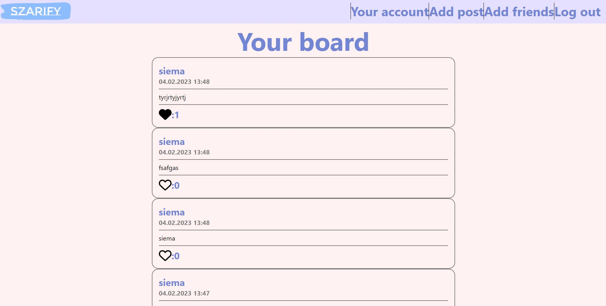

#Szarify

Full stack app created with:
frontend: React + Typescript
backend: Express + Mysql database

link to hosting: https://szarify-website.vercel.app/

##In the app you can:

<ul>
    <li>Create accoount</li>
    <li>Find and follow friends</li>
    <li>Create a post</li>
    <li>Check your followed friends posts</li>
    <li>Like another posts</li>
</ul>

Website is fully compatible with desktops and mobile devices

Posts are fetched as much as you will watch (when you scroll down next posts are fetched)

